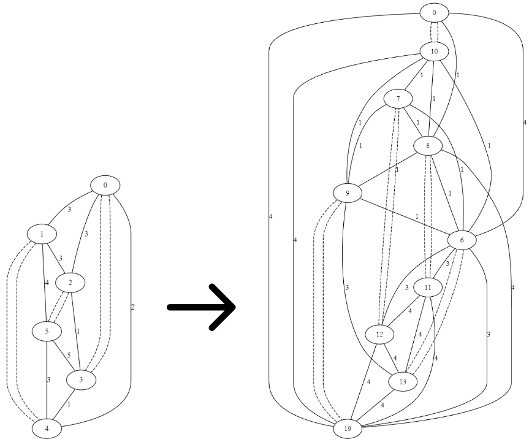

# Generating-Tensegrity-Structures
Daniel Casper Computer Science Thesis 2024/25

## Abstract

Tensegrity form-finding is a complex field relating to the discovery and creation of new tensegrity structures. This process has been approached and practiced from many different angles ranging from mechanical, to algorithmic. When researching the use of evolutionary algorithms to evolve irregular structures, the experimenters were met with success, however the line of interest ended there. Proposed here is that algorithms explored in old studies are recreated and it is attempted to match or improve upon the results presented prior. Through the application of newer methods as well as a fresh perspective on the problem this paper also aims to explore what changes can be made to the original algorithms to produce new tensegrities.

## Methods

Grows and evaluates unique large irregular tensegrity structures. Employs a map L-system to manipulate 2d graphical representations of tensegrity structures and an evolutionary algorithm using variable crossover, primary, and secondary mutation rates, and maintaining elitism to evaluate the population.

Main driver located in algorithm.py.

### Example
A 2d representation of a 3-Bar tensegrity transformed by the map L-System into a 5-bar tensegrity 
 
